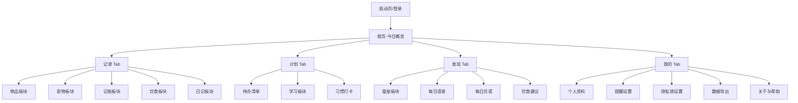
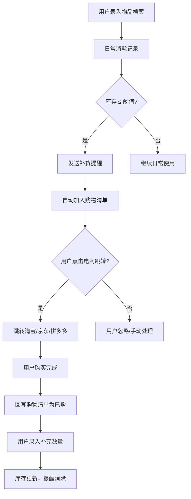
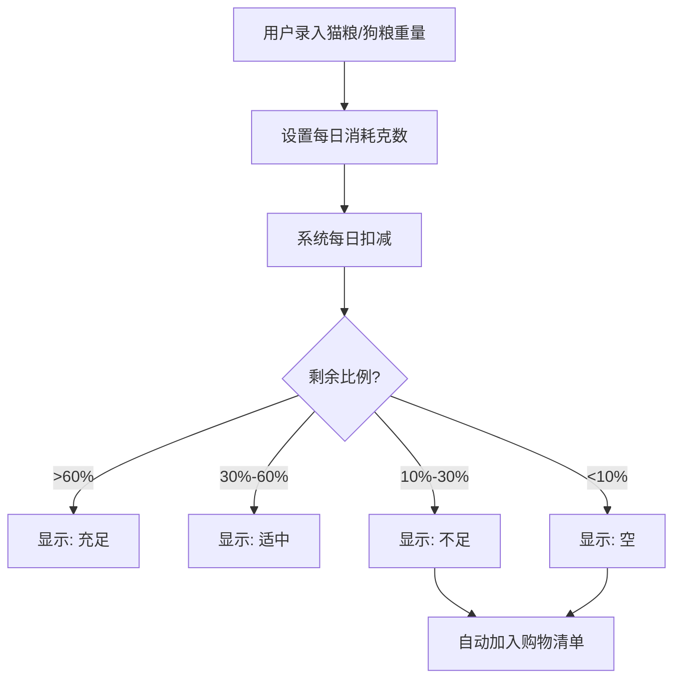
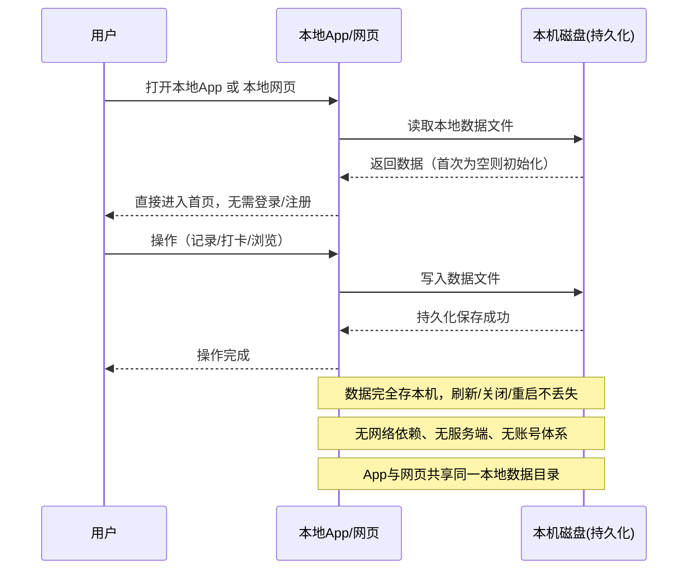
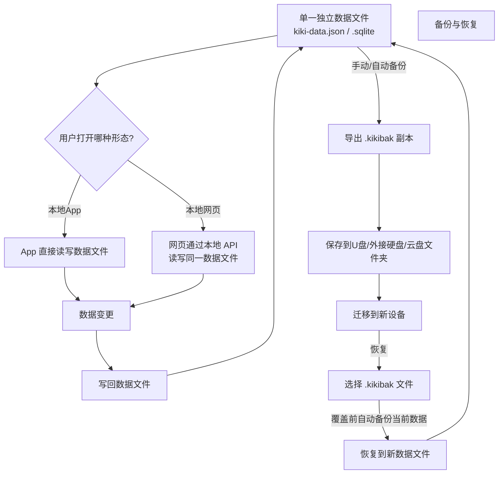

# kiki星球 产品需求文档（PRD）

> **文档版本**：v2.1.0
> **创建日期**：2026-08-26
> **最后更新**：2026-08-26（明确数据存储方案：独立文件存储）
> **产品形态**：本地网页 + 本地 App（双形态功能对等，**仅在用户本机运行，纯离线**）
> **运行环境**：用户个人电脑（macOS / Windows）
> **文档状态**：已确认核心需求 / 待评审

> ⚠️ **重要约束（v2.0.0 核心变更）**
> - 本产品**仅在本机浏览器/App 中运行**，不联网、不部署、不使用云数据库
> - **无需登录**、无需账号体系
> - 数据**保存在本机独立文件**中（单一数据文件），刷新、关闭、重启后不丢失
> - **不做手机端**、不做小程序、不做云同步
> - App 与网页**共享同一份本地数据文件**

> ✅ **v2.1.0 存储方案确认**
> - 所有业务数据统一存储在**一个独立数据文件**中（建议 `.json` 单文件或 SQLite 单文件）
> - App 直接读写该文件；网页通过本地 File API / IndexedDB 镜像该文件
> - 支持**手动备份与恢复**（导出/导入整个数据文件），见 F-22.4.1

---

## 一、需求概述

### 1.1 产品背景

现代年轻用户（尤其年轻女性、学生、养宠人群）面临"生活琐事多、记忆负担重、宠物照顾事项杂、想记录但工具太复杂"的痛点。现有工具要么功能过重（如完整 ERP 式管理），要么功能单一（仅记账或仅待办），缺乏一个"轻量、温暖、有仪式感"的一体化生活管理工具。

### 1.2 产品定位

**一句话定位**：一个面向年轻用户，尤其是年轻女性、学生、养宠人群的"轻生活管理 + 每日仪式感"工具。

**核心价值**：帮助用户减少日常琐事的记忆负担，同时提供每日语录、花语、星座等轻内容，让用户每天打开产品都有新鲜感和陪伴感。

**关键词**：记录、提醒、陪伴、轻量、仪式感、生活管理。

### 1.3 目标用户画像

| 维度 | 描述 |
|------|------|
| 年龄 | 18-35 岁 |
| 性别 | 以女性为主，但功能中性，不排斥男性 |
| 身份 | 学生、职场新人、养宠人群、喜欢记录生活的人 |
| 场景 | 日常备忘、宠物照顾、记账、日记、学习打卡、睡前浏览星座/花语 |
| 痛点 | 生活琐事多容易忘、宠物照顾事项杂、想记录但不想太复杂、需要低成本获得每日小确幸 |

### 1.4 核心目标

1. **减负**：通过智能提醒，帮助用户不再遗漏日常琐事（物品补货、宠物疫苗、账单等）。
2. **陪伴**：每日提供有温度的轻内容（语录、花语、星座），形成每日打开习惯。
3. **轻量**：所有记录操作 3 步内完成，不追求复杂管理系统，追求"随手记"。
4. **私密**：所有用户数据为私密内容，不做社区共享，保障用户隐私。

### 1.5 设计原则

| 原则 | 说明 |
|------|------|
| 轻量优先 | 任何功能 3 步内完成，避免复杂表单 |
| 不打扰 | 提醒频率用户自定义，避免过度推送 |
| 有温度 | 视觉温暖、文案有情感，避免冰冷工具感 |
| 私密性 | 所有数据私密，提供密码/指纹锁 |
| 纯离线 | 不依赖网络、不联网、不部署，所有数据存本机 |
| 持久化 | 刷新/关闭/重启后数据不丢失 |
| 双形态一致 | 本地网页与本地 App 功能对等，共享数据 |

### 1.6 非功能性需求

| 类别 | 要求 |
|------|------|
| 运行环境 | 本地电脑（macOS / Windows）；本地浏览器或本地 App |
| 部署要求 | **无需部署**，本地直接运行 |
| 性能 | 首屏加载 ≤ 2s，列表滑动流畅 |
| 兼容性 | 本地 App 支持 macOS / Windows；网页支持主流浏览器（Chrome/Safari/Edge/Firefox） |
| 数据存储 | **独立文件存储**：所有业务数据保存在**单一本地数据文件**中（建议 `kiki-data.json` 或 `kiki-data.sqlite`），App 直接读写该文件，网页通过本地 API 镜像读写。刷新/关闭/重启不丢失 |
| 离线运行 | **完全离线**，无网络依赖。星座/语录/花语等每日内容采用**预置内容库 + 本地轮换**，不实时联网获取 |
| 安全性 | 隐私数据本地加密存储，支持密码/指纹锁（App 支持指纹/Face ID，网页支持密码） |
| 双形态数据共享 | App 与网页**共享同一本地数据文件**（同一文件路径），无需账号同步 |
| 可备份 | 用户可手动导出整个数据文件为备份，支持导入恢复（F-22.4.1） |
| 可导出 | 用户可随时将数据文件内容导出为 Excel/PDF/JSON 等格式（F-22.4） |

---

## 二、信息架构

### 2.1 底部导航（5 Tab）

| Tab | 内容 | 说明 |
|-----|------|------|
| 首页 | 今日概览：待办、提醒、今日语录、今日花语、星座运势摘要 | 聚合展示，一屏掌握今日要点 |
| 记录 | 物品、宠物、记账、饮食、日记入口 | 偏"记录型"功能集合 |
| 计划 | 待办、学习、习惯打卡 | 偏"规划型"功能集合 |
| 发现 | 星座、语录、花语、饮食建议等内容 | 偏"内容消费型" |
| 我的 | 个人资料、设置、数据导出/备份/恢复、提醒设置、隐私锁 | 用户中心 |

> 网页与 App 采用相同的 5 Tab 结构，保持体验一致。

### 2.2 页面关系图

---

## 三、功能清单

> **优先级说明**
> - **P0**：MVP 必做，第一版上线
> - **P1**：V1.1 第二版
> - **P2**：V1.2 第三版及以后

---

### 模块 1：物品板块

**参考产品**：有数
**优先级**：P0

#### F-1.1 物品档案

| 项 | 内容 |
|----|------|
| 功能名称 | 物品档案管理 |
| 所属模块 | 物品 |
| 优先级 | P0 |
| 页面 | 记录 → 物品 → 档案列表/详情 |
| 操作角色 | 已登录用户 |

**字段说明**：

| 字段名 | 类型 | 必填 | 校验规则 | 默认值 | 说明 |
|--------|------|------|----------|--------|------|
| 名称 | string | 是 | 1-20 字 | - | 物品名称 |
| 分类 | enum | 是 | 预设分类 | 其他 | 日用/食品/清洁/个护/宠物用品/其他 |
| 库存数量 | number | 是 | ≥ 0 | 0 | 当前库存 |
| 单位 | string | 是 | 预设单位 | 件 | 个/包/瓶/盒/袋/件/自定义 |
| 存放位置 | string | 否 | - | - | 如"厨房柜子" |
| 有效期 | date | 否 | 晚于今天 | - | 食品类建议填写 |
| 预警阈值 | number | 否 | ≥ 0 | - | 低于此值触发补货提醒 |
| 图片 | image | 否 | ≤ 5 张 | - | 物品图片 |
| 备注 | text | 否 | ≤ 200 字 | - | 补充说明 |

**按钮/操作**：

| 操作 | 触发条件 | 行为 | 异常处理 |
|------|----------|------|----------|
| 新增物品 | 用户点击"+" | 打开新增表单，填写字段 | 必填项校验失败时提示 |
| 编辑物品 | 详情页点击"编辑" | 打开编辑表单 | 同上 |
| 删除物品 | 详情页点击"删除" | 二次确认后软删除 | - |
| 快速增减库存 | 列表/详情页"+/-"按钮 | 一键加减库存，记录消耗 | 库存不能小于 0 |

**交互说明**：
1. 物品列表支持按分类筛选、按名称搜索。
2. 库存低于预警阈值时，物品卡片角标显示"⚠️ 需补货"。
3. 删除物品为软删除，保留 30 天后物理清除。

**验收标准**：
- 用户可新增、编辑、删除物品档案。
- 库存增减即时生效，列表角标状态实时更新。
- 预警阈值触发后自动加入购物清单（见 F-1.4）。

---

#### F-1.2 消耗记录

| 项 | 内容 |
|----|------|
| 功能名称 | 物品消耗记录 |
| 所属模块 | 物品 |
| 优先级 | P0 |
| 页面 | 物品详情 → 消耗记录 |
| 操作角色 | 已登录用户 |

**字段说明**：

| 字段名 | 类型 | 必填 | 说明 |
|--------|------|------|------|
| 关联物品 | ref | 是 | 关联物品档案 |
| 消耗/补充数量 | number | 是 | 正数补充，负数消耗 |
| 记录时间 | datetime | 是 | 默认当前时间 |
| 备注 | string | 否 | 如"本周使用" |

**按钮/操作**：

| 操作 | 触发条件 | 行为 | 异常处理 |
|------|----------|------|----------|
| 记录消耗 | 点击"消耗" | 数量输入（默认 1），自动扣减库存 | 库存不足提示 |
| 记录补充 | 点击"补充" | 数量输入，自动增加库存 | - |
| 查看历史 | 详情页"消耗历史" | 展示该物品所有消耗记录 | - |

**交互说明**：
1. 消耗记录与物品档案库存联动，操作即时反映。
2. 支持批量消耗（一次记录多个物品）。

**验收标准**：
- 每次消耗/补充后库存数量正确更新。
- 消耗历史可按时间倒序查看。

---

#### F-1.3 补货提醒

| 项 | 内容 |
|----|------|
| 功能名称 | 补货提醒 |
| 所属模块 | 物品 |
| 优先级 | P0 |
| 页面 | 系统提醒 |
| 操作角色 | 已登录用户 |

**按钮/操作**：

| 操作 | 触发条件 | 行为 | 异常处理 |
|------|----------|------|----------|
| 发送补货提醒 | 库存 ≤ 预警阈值 | 站内消息 + 微信服务通知 | 通知发送失败重试 3 次 |
| 忽略提醒 | 用户点击"忽略" | 本次忽略，24h 后再次提醒 | - |
| 加入购物清单 | 用户点击"加入清单"或自动 | 加入购物清单 | - |

**交互说明**：
1. 提醒方式：**纯本地提醒** — App 使用系统本地通知（macOS Notification Center / Windows Toast）；网页使用浏览器 Notification API。
2. 提醒频率：同一物品 24h 内最多提醒 1 次，用户可在设置中调整。
3. 支持"消耗周期"推算：基于历史消耗记录，推算"一卷纸大约用 3 天"。
4. **纯离线说明**：提醒仅在本机应用运行时或后台时触发，不支持跨设备推送。

**验收标准**：
- 库存达到阈值时准时触发提醒。
- 提醒可被忽略，但会在合理周期后重复。

---

#### F-1.4 购物清单

| 项 | 内容 |
|----|------|
| 功能名称 | 购物清单 |
| 所属模块 | 物品 |
| 优先级 | P0 |
| 页面 | 记录 → 物品 → 购物清单 |
| 操作角色 | 已登录用户 |

**字段说明**：

| 字段名 | 类型 | 必填 | 说明 |
|--------|------|------|------|
| 物品名称 | string | 是 | 自动从补货提醒带入，可手动添加 |
| 数量 | number | 否 | 建议购买数量 |
| 来源 | enum | 是 | 补货提醒/手动添加 |
| 状态 | enum | 是 | 待购/已购 |
| 添加时间 | datetime | 是 | - |

**按钮/操作**：

| 操作 | 触发条件 | 行为 | 异常处理 |
|------|----------|------|----------|
| 手动添加 | 点击"+" | 输入物品名称、数量 | - |
| 勾选已购 | 点击勾选框 | 标记为已购，可填写实际购买数量，回写库存 | - |
| 删除条目 | 左滑删除 | 移除该条目 | - |

**验收标准**：
- 补货提醒自动加入购物清单。
- 手动添加和勾选已购功能正常。

---

#### F-1.5 电商跳转

| 项 | 内容 |
|----|------|
| 功能名称 | 电商跳转 |
| 所属模块 | 物品 |
| 优先级 | P0 |
| 页面 | 购物清单条目 |
| 操作角色 | 已登录用户 |

**按钮/操作**：

| 操作 | 触发条件 | 行为 | 异常处理 |
|------|----------|------|----------|
| 跳转搜索 | 点击"去淘宝/京东/拼多多" | 跳转对应电商平台搜索该物品名称 | 跳转失败提示 |

**交互说明**：
1. 电商跳转需**联网**打开外部网站（淘宝/京东/拼多多）。
2. ⚠️ **离线模式说明**：由于本产品定位为纯本地运行，电商跳转功能为"可选外链"性质 — 用户点击后由系统浏览器打开外站，与本产品数据无关联。若用户完全离线，则跳转按钮置灰提示"需联网访问"。

**验收标准**：联网状态下点击后能正确跳转至电商平台并搜索对应商品；离线状态下按钮置灰并提示。

---

#### F-1.6 历史消耗统计

| 项 | 内容 |
|----|------|
| 功能名称 | 历史消耗统计 |
| 所属模块 | 物品 |
| 优先级 | P1 |
| 页面 | 物品详情 → 统计 |
| 操作角色 | 已登录用户 |

**交互说明**：
1. 统计某类物品月均消耗量。
2. 辅助用户设置更合理的预警阈值。

**验收标准**：能正确统计并展示月均消耗数据。

---

### 模块 2：宠物板块

**参考产品**：宠本本
**优先级**：P0

#### F-2.1 宠物档案

| 项 | 内容 |
|----|------|
| 功能名称 | 宠物档案管理 |
| 所属模块 | 宠物 |
| 优先级 | P0 |
| 页面 | 记录 → 宠物 → 档案 |
| 操作角色 | 已登录用户 |

**字段说明**：

| 字段名 | 类型 | 必填 | 校验规则 | 默认值 | 说明 |
|--------|------|------|----------|--------|------|
| 名字 | string | 是 | 1-10 字 | - | 宠物名字 |
| 种类 | enum | 是 | 猫/狗/其他 | 猫 | - |
| 品种 | string | 否 | - | - | 如"英短" |
| 生日 | date | 否 | 早于今天 | - | 用于推算年龄 |
| 体重 | number | 否 | > 0 | - | 单位 kg |
| 照片 | image | 否 | ≤ 9 张 | - | - |
| 毛色 | string | 否 | - | - | - |
| 性别 | enum | 否 | 公/母 | - | - |
| 是否绝育 | boolean | 否 | - | false | - |

**按钮/操作**：

| 操作 | 触发条件 | 行为 | 异常处理 |
|------|----------|------|----------|
| 新增宠物 | 点击"+" | 打开新增表单 | - |
| 编辑宠物 | 详情页"编辑" | 打开编辑表单 | - |
| 删除宠物 | 详情页"删除" | 二次确认后软删除 | - |
| 切换宠物 | 顶部宠物头像切换 | 切换当前选中宠物 | - |

**交互说明**：
1. 支持多宠物管理，每个宠物独立提醒和档案。
2. 顶部宠物头像横向列表，支持快速切换。

**验收标准**：
- 支持多宠物的增删改查。
- 切换宠物后，所有提醒和记录跟随切换。

---

#### F-2.2 疫苗提醒

| 项 | 内容 |
|----|------|
| 功能名称 | 疫苗提醒 |
| 所属模块 | 宠物 |
| 优先级 | P0 |
| 页面 | 宠物详情 → 健康 → 疫苗 |
| 操作角色 | 已登录用户 |

**字段说明**：

| 字段名 | 类型 | 必填 | 说明 |
|--------|------|------|------|
| 疫苗名称 | string | 是 | 如"猫三联" |
| 接种日期 | date | 是 | 本次接种时间 |
| 下次接种日期 | date | 否 | 手动设置或按周期推算 |
| 备注 | string | 否 | - |

**按钮/操作**：

| 操作 | 触发条件 | 行为 | 异常处理 |
|------|----------|------|----------|
| 记录接种 | 点击"记录接种" | 填写疫苗信息 | - |
| 提醒 | 临近下次接种日期 | 提前 7 天/3 天/1 天提醒 | - |
| 标记完成 | 点击"已接种" | 更新接种记录 | - |

**验收标准**：能正确记录和提醒疫苗接种。

---

#### F-2.3 驱虫提醒

| 项 | 内容 |
|----|------|
| 功能名称 | 驱虫提醒 |
| 所属模块 | 宠物 |
| 优先级 | P0 |
| 页面 | 宠物详情 → 健康 → 驱虫 |
| 操作角色 | 已登录用户 |

**字段说明**：

| 字段名 | 类型 | 必填 | 说明 |
|--------|------|------|------|
| 类型 | enum | 是 | 体内/体外 |
| 上次日期 | date | 是 | - |
| 周期 | number | 是 | 间隔天数，默认 30/90 |
| 备注 | string | 否 | - |

**交互说明**：支持自定义驱虫周期，到期提醒。

**验收标准**：能按自定义周期正确提醒。

---

#### F-2.4 健康提醒

| 项 | 内容 |
|----|------|
| 功能名称 | 健康提醒（自定义） |
| 所属模块 | 宠物 |
| 优先级 | P0 |
| 页面 | 宠物详情 → 健康 |
| 操作角色 | 已登录用户 |

**交互说明**：
1. 用户可自定义体检、洗澡、美容、剪指甲等提醒事项。
2. 每项提醒可设置周期（如每月洗澡 1 次）。

**验收标准**：自定义提醒能按周期触发。

---

#### F-2.5 猫粮/狗粮余量

| 项 | 内容 |
|----|------|
| 功能名称 | 猫粮/狗粮余量 |
| 所属模块 | 宠物 |
| 优先级 | P0 |
| 页面 | 宠物详情 → 粮食 |
| 操作角色 | 已登录用户 |

**字段说明**：

| 字段名 | 类型 | 必填 | 说明 |
|--------|------|------|------|
| 录入重量 | number | 是 | 购买重量，单位 kg |
| 每日消耗 | number | 是 | 每日消耗克数 |
| 剩余等级 | enum | - | 系统计算：充足/适中/不足/空 |

**按钮/操作**：

| 操作 | 触发条件 | 行为 | 异常处理 |
|------|----------|------|----------|
| 录入购买 | 点击"录入" | 填写重量 | - |
| 修改消耗 | 点击"消耗" | 修改每日消耗克数 | - |
| 加入购物清单 | 剩余为"不足/空" | 自动加入购物清单 | - |

**交互说明**：
1. **不显示精确余量值**，只显示模糊等级，避免用户焦虑。
2. 系统根据 `录入重量 - (已过天数 × 每日消耗)` 推算剩余等级。
3. 等级阈值：充足 > 60%，适中 30%-60%，不足 10%-30%，空 < 10%。

**验收标准**：
- 余量等级随时间正确递减。
- 不足/空状态自动触发购物清单加入。

---

#### F-2.6 猫砂提醒

| 项 | 内容 |
|----|------|
| 功能名称 | 猫砂提醒 |
| 所属模块 | 宠物 |
| 优先级 | P0 |
| 页面 | 宠物详情 → 猫砂 |
| 操作角色 | 已登录用户 |

**交互说明**：
1. 记录猫砂更换周期（如每 7 天更换）。
2. 到期提醒购买或更换。

**验收标准**：能按周期正确提醒。

---

#### F-2.7 成长记录

| 项 | 内容 |
|----|------|
| 功能名称 | 成长记录 |
| 所属模块 | 宠物 |
| 优先级 | P1 |
| 页面 | 宠物详情 → 成长 |
| 操作角色 | 已登录用户 |

**交互说明**：
1. 记录体重变化，生成体重趋势图。
2. 记录大事记（如"今天学会开门"）。
3. 照片时间轴展示。

**验收标准**：体重趋势和照片时间轴正常展示。

---

### 模块 3：每日待办

**优先级**：P0

#### F-3.1 待办清单

| 项 | 内容 |
|----|------|
| 功能名称 | 待办清单管理 |
| 所属模块 | 每日待办 |
| 优先级 | P0 |
| 页面 | 计划 → 待办 |
| 操作角色 | 已登录用户 |

**字段说明**：

| 字段名 | 类型 | 必填 | 校验规则 | 默认值 | 说明 |
|--------|------|------|----------|--------|------|
| 标题 | string | 是 | 1-50 字 | - | 任务名称 |
| 优先级 | enum | 否 | - | 中 | 高/中/低 |
| 截止时间 | datetime | 否 | 晚于当前 | - | - |
| 重复周期 | enum | 否 | - | 不重复 | 不重复/每日/每周/每月/自定义 |
| 分类 | string | 否 | - | 默认 | 自定义分类 |
| 备注 | text | 否 | - | - | - |

**按钮/操作**：

| 操作 | 触发条件 | 行为 | 异常处理 |
|------|----------|------|----------|
| 新增任务 | 点击"+" | 打开新增表单 | - |
| 完成 | 点击勾选框 | 标记完成，自动归档 | - |
| 编辑 | 点击任务 | 打开编辑表单 | - |
| 删除 | 左滑删除 | 删除任务 | - |
| 延迟 | 提醒弹出时点击"延迟" | 延后 15min/1h/明天 | - |

**交互说明**：
1. 重复任务按周期自动生成下一周期任务。
2. 首页"今日视图"展示今日所有待办，可快速完成。

**验收标准**：
- 新增、编辑、删除、完成功能正常。
- 重复任务按周期自动生成。

---

#### F-3.2 今日视图

| 项 | 内容 |
|----|------|
| 功能名称 | 今日待办视图 |
| 所属模块 | 每日待办 |
| 优先级 | P0 |
| 页面 | 首页 |
| 操作角色 | 已登录用户 |

**交互说明**：
1. 首页聚合展示今日待办、今日提醒、今日语录、今日花语、星座运势摘要。
2. 可直接在首页勾选完成待办。

**验收标准**：首页一屏展示今日要点，可快速操作。

---

### 模块 4：学习板块

**优先级**：P1
**设计原则**：轻量化，重点在打卡和提醒，不做复杂学习管理系统。

#### F-4.1 学习目标与计划

| 项 | 内容 |
|----|------|
| 功能名称 | 学习目标与计划 |
| 所属模块 | 学习 |
| 优先级 | P1 |
| 页面 | 计划 → 学习 |
| 操作角色 | 已登录用户 |

**字段说明**：

| 字段名 | 类型 | 必填 | 说明 |
|--------|------|------|------|
| 目标名称 | string | 是 | 如"考研""学英语" |
| 目标描述 | text | 否 | - |
| 截止日期 | date | 否 | - |
| 关联待办 | ref[] | 否 | 拆解为每日待办 |
| 文件/链接 | file/url | 否 | 上传或保存学习资料 |

**交互说明**：
1. 学习目标可拆解为每日任务，关联到待办清单。
2. 支持上传文件或保存链接，方便查看学习资料。

**验收标准**：目标可创建、拆解、关联待办、上传资料。

---

#### F-4.2 每日打卡与计时

| 项 | 内容 |
|----|------|
| 功能名称 | 学习打卡与计时 |
| 所属模块 | 学习 |
| 优先级 | P1 |
| 页面 | 计划 → 学习 → 打卡 |
| 操作角色 | 已登录用户 |

**交互说明**：
1. 每日学习打卡，统计连续天数。
2. 可选番茄钟（25min）或正计时模式，记录学习时长。

**验收标准**：打卡和计时功能正常，连续天数统计准确。

---

#### F-4.3 学习复盘

| 项 | 内容 |
|----|------|
| 功能名称 | 学习复盘 |
| 所属模块 | 学习 |
| 优先级 | P1 |
| 页面 | 计划 → 学习 → 复盘 |
| 操作角色 | 已登录用户 |

**交互说明**：每日/每周自动生成学习总结，用户可手动补充。

**验收标准**：能自动生成和手动补充复盘。

---

### 模块 5：日记板块

**优先级**：P0

#### F-5.1 日记编辑

| 项 | 内容 |
|----|------|
| 功能名称 | 日记编辑 |
| 所属模块 | 日记 |
| 优先级 | P0 |
| 页面 | 记录 → 日记 → 编辑 |
| 操作角色 | 已登录用户 |

**字段说明**：

| 字段名 | 类型 | 必填 | 校验规则 | 默认值 | 说明 |
|--------|------|------|----------|--------|------|
| 日期 | date | 是 | - | 今天 | - |
| 内容 | text | 是 | ≤ 5000 字 | - | - |
| 图片 | image[] | 否 | ≤ 9 张 | - | - |
| 心情 | enum | 否 | - | - | 开心/平静/难过/愤怒/疲惫 |
| 天气 | enum | 否 | - | - | 晴/阴/雨/雪/多云 |
| 标签 | string[] | 否 | - | - | 自定义标签 |

**按钮/操作**：

| 操作 | 触发条件 | 行为 | 异常处理 |
|------|----------|------|----------|
| 保存 | 点击"保存" | 保存日记 | 内容为空时提示 |
| 编辑 | 详情页"编辑" | 打开编辑表单 | - |
| 删除 | 详情页"删除" | 二次确认后软删除 | - |

**交互说明**：
1. 日记为私密内容，进入需通过隐私锁（见 F-13.2）。
2. 支持自动获取当前天气（⚠️ 默认值待确认：是否接入天气 API）。

**验收标准**：日记可增删改查，进入前需解锁。

---

#### F-5.2 日记时间轴与搜索

| 项 | 内容 |
|----|------|
| 功能名称 | 日记时间轴与搜索 |
| 所属模块 | 日记 |
| 优先级 | P0 |
| 页面 | 记录 → 日记 → 列表 |
| 操作角色 | 已登录用户 |

**交互说明**：
1. 时间轴按日期倒序展示。
2. 搜索支持关键词、标签、日期范围筛选。

**验收标准**：时间轴正常展示，搜索结果准确。

---

#### F-5.3 日记导出

| 项 | 内容 |
|----|------|
| 功能名称 | 日记导出 |
| 所属模块 | 日记 |
| 优先级 | P0 |
| 页面 | 日记列表 → 导出 |
| 操作角色 | 已登录用户 |

**交互说明**：
1. 支持导出为 PDF 或长图片。
2. 可选择导出范围（单篇/月份/全部）。

**验收标准**：导出文件格式正确、内容完整。

---

### 模块 6：星座板块

**优先级**：P1

> ✅ **版权合规说明（已确认）**：星座运势内容采用**自产内容**方案，不抓取第三方。
>
> 📦 **离线内容库机制**：需建立本地星座运势内容库（按星座 × 日期预置内容）。系统每日从内容库中轮换/匹配当日运势，无需联网获取。内容库可随版本更新扩充。

#### F-6.1 星座设置与每日运势

| 项 | 内容 |
|----|------|
| 功能名称 | 星座设置与每日运势 |
| 所属模块 | 星座 |
| 优先级 | P1 |
| 页面 | 发现 → 星座 |
| 操作角色 | 已登录用户 |

**字段说明**：

| 字段名 | 类型 | 必填 | 说明 |
|--------|------|------|------|
| 我的星座 | enum | 否 | 12 星座，首次进入选择 |
| 综合运势 | string | - | 每日更新 |
| 爱情/事业/财运/健康 | string | - | 分项运势 |
| 宜做/忌做 | string[] | - | - |
| 幸运色/幸运数字 | string/number | - | - |

**交互说明**：
1. 首页展示星座运势摘要，点击进入查看详情。
2. 可切换查看其他星座。

**验收标准**：每日运势正确展示，可切换星座。

---

#### F-6.2 周/月运势

| 项 | 内容 |
|----|------|
| 功能名称 | 周/月运势 |
| 所属模块 | 星座 |
| 优先级 | P1（进阶） |
| 页面 | 发现 → 星座 → 周/月 |
| 操作角色 | 已登录用户 |

**验收标准**：周/月运势内容正确展示。

---

### 模块 7：饮食板块

**优先级**：P1

#### F-7.1 饮食记录

| 项 | 内容 |
|----|------|
| 功能名称 | 饮食记录 |
| 所属模块 | 饮食 |
| 优先级 | P1 |
| 页面 | 记录 → 饮食 |
| 操作角色 | 已登录用户 |

**字段说明**：

| 字段名 | 类型 | 必填 | 说明 |
|--------|------|------|------|
| 日期 | date | 是 | - |
| 餐次 | enum | 是 | 早餐/午餐/晚餐/加餐 |
| 内容 | text | 是 | 文字描述 |
| 图片 | image | 否 | 拍照记录 |
| 卡路里 | number | 否 | 简单记录热量，不必精确 |

**交互说明**：支持拍照或文字快速记录。

**验收标准**：饮食记录可增删改查。

---

#### F-7.2 饮水打卡

| 项 | 内容 |
|----|------|
| 功能名称 | 饮水打卡 |
| 所属模块 | 饮食 |
| 优先级 | P1 |
| 页面 | 记录 → 饮食 → 饮水 |
| 操作角色 | 已登录用户 |

**交互说明**：
1. 每日饮水量打卡，默认目标 2000ml。
2. 一键加减（默认 200ml/次）。

**验收标准**：饮水打卡和进度展示正常。

---

#### F-7.3 饮食建议与菜谱

| 项 | 内容 |
|----|------|
| 功能名称 | 饮食建议与菜谱推荐 |
| 所属模块 | 饮食 |
| 优先级 | P1（进阶） |
| 页面 | 发现 → 饮食建议 |
| 操作角色 | 已登录用户 |

**交互说明**：
1. 根据饮食记录给出轻提醒，如"今天蔬菜摄入偏少"。
2. 根据用户偏好推荐简单菜谱。

**验收标准**：建议和菜谱合理展示。

---

### 模块 8：记账板块

**优先级**：P0

#### F-8.1 收支记录

| 项 | 内容 |
|----|------|
| 功能名称 | 收支记录 |
| 所属模块 | 记账 |
| 优先级 | P0 |
| 页面 | 记录 → 记账 |
| 操作角色 | 已登录用户 |

**字段说明**：

| 字段名 | 类型 | 必填 | 校验规则 | 默认值 | 说明 |
|--------|------|------|----------|--------|------|
| 类型 | enum | 是 | - | 支出 | 收入/支出 |
| 金额 | number | 是 | > 0 | - | 保留两位小数 |
| 分类 | enum | 是 | - | - | 餐饮/交通/宠物/日用/娱乐/其他（可自定义） |
| 日期 | date | 是 | - | 今天 | - |
| 备注 | string | 否 | ≤ 50 字 | - | - |

**按钮/操作**：

| 操作 | 触发条件 | 行为 | 异常处理 |
|------|----------|------|----------|
| 新增 | 点击"+" | 打开新增表单 | - |
| 编辑 | 点击条目 | 打开编辑表单 | - |
| 删除 | 左滑删除 | 删除条目 | - |

**交互说明**：
1. 纯手动记录，不对接银行卡/支付账单自动导入。
2. 支持自定义分类管理。

**验收标准**：收支记录可增删改查。

---

#### F-8.2 预算与统计

| 项 | 内容 |
|----|------|
| 功能名称 | 预算与统计 |
| 所属模块 | 记账 |
| 优先级 | P0 |
| 页面 | 记录 → 记账 → 统计 |
| 操作角色 | 已登录用户 |

**交互说明**：
1. 支持设置月度总预算和分类预算。
2. 月度/年度收支统计，图表展示（饼图/柱状图/折线图）。
3. 预算超支时提醒。

**验收标准**：预算设置生效，统计图表正确展示，超支提醒触发。

---

#### F-8.3 账单导出

| 项 | 内容 |
|----|------|
| 功能名称 | 账单导出 |
| 所属模块 | 记账 |
| 优先级 | P0 |
| 页面 | 记录 → 记账 → 导出 |
| 操作角色 | 已登录用户 |

**交互说明**：支持导出 Excel 或图片，可选择时间范围。

**验收标准**：导出文件格式正确、数据完整。

---

### 模块 9：每日语录

**优先级**：P0

> 📦 **离线内容库机制**：每日语录和每日花语均采用**本地预置内容库 + 按日期轮换**机制，无需联网获取。内容库可随版本更新扩充，用户也可手动导入自定义语录/花语包。

#### F-9.1 每日一句

| 项 | 内容 |
|----|------|
| 功能名称 | 每日一句 |
| 所属模块 | 每日语录 |
| 优先级 | P0 |
| 页面 | 首页 / 发现 → 语录 |
| 操作角色 | 已登录用户 |

**交互说明**：
1. 每日推送一条简短美好的生活语录。
2. 支持分类：励志、治愈、爱情、友情等。
3. 可生成语录卡片并分享。

**按钮/操作**：

| 操作 | 触发条件 | 行为 | 异常处理 |
|------|----------|------|----------|
| 生成卡片 | 点击"生成卡片" | 生成精美图片卡片 | - |
| 分享 | 点击"分享" | 分享到微信好友/朋友圈/保存图片 | - |
| 收藏 | 点击"❤️" | 收藏语录 | - |
| 换一条 | 点击"换一条" | 随机换一条（每日限 3 次） | - |

**验收标准**：每日语录正确展示，卡片生成和分享功能正常。

---

#### F-9.2 语录收藏

| 项 | 内容 |
|----|------|
| 功能名称 | 语录收藏 |
| 所属模块 | 每日语录 |
| 优先级 | P0 |
| 页面 | 发现 → 语录 → 收藏 |
| 操作角色 | 已登录用户 |

**验收标准**：收藏和取消收藏功能正常，收藏列表可查看。

---

### 模块 10：每日花语

**优先级**：P0

#### F-10.1 每日一花

| 项 | 内容 |
|----|------|
| 功能名称 | 每日一花 |
| 所属模块 | 每日花语 |
| 优先级 | P0 |
| 页面 | 首页 / 发现 → 花语 |
| 操作角色 | 已登录用户 |

**字段说明**：

| 字段名 | 类型 | 必填 | 说明 |
|--------|------|------|------|
| 花名 | string | 是 | - |
| 花语 | string | 是 | 寓意说明 |
| 图片 | image | 是 | 花的图片 |
| 养护知识 | text | 否 | 简单养护小贴士 |
| 日期 | date | 是 | - |

**交互说明**：
1. 每日介绍一款花，含花语、寓意、图片、养护知识。
2. 可查看往期花语历史。
3. 可收藏喜欢的花。

**验收标准**：每日花语正确展示，历史查看和收藏功能正常。

---

### 模块 11：习惯打卡（扩展）

**优先级**：P1

#### F-11.1 习惯打卡

| 项 | 内容 |
|----|------|
| 功能名称 | 习惯打卡 |
| 所属模块 | 习惯 |
| 优先级 | P1 |
| 页面 | 计划 → 习惯打卡 |
| 操作角色 | 已登录用户 |

**交互说明**：
1. 自定义习惯：喝水、早睡、运动、护肤、阅读等。
2. 与每日待办联动，形成"每日仪式感"。
3. 连续打卡天数统计，打卡日历视图。

**验收标准**：习惯可增删改，打卡和统计功能正常。

---

### 模块 12：情绪/心情记录（扩展）

**优先级**：P2

#### F-12.1 情绪记录

**交互说明**：
1. 每天选择心情表情，写一句心情日记。
2. 与日记板块联动，形成情绪趋势图。

**验收标准**：情绪记录和趋势图正常展示。

---

### 模块 13：纪念日/生日提醒（扩展）

**优先级**：P1

#### F-13.1 纪念日提醒

**交互说明**：
1. 记录重要日期（生日、纪念日），提前提醒。
2. 可关联礼物清单、日程。

**验收标准**：纪念日能正确提前提醒。

---

### 模块 14：植物养护（扩展）

**优先级**：P2

#### F-14.1 植物养护

**交互说明**：
1. 与每日花语自然结合。
2. 记录家中植物浇水、施肥、换盆提醒。

**验收标准**：植物养护提醒按周期正确触发。

---

### 模块 15：家务/空间管理（扩展）

**优先级**：P2

#### F-15.1 家务清单

**交互说明**：家务清单，周期性提醒打扫、换床单、清理冰箱等。

**验收标准**：家务提醒按周期正确触发。

---

### 模块 16：阅读/影视清单（扩展）

**优先级**：P2

#### F-16.1 清单管理

**交互说明**：
1. 记录想看的书、电影、剧集，标记进度。
2. 可与学习板块联动。

**验收标准**：清单增删改查和进度标记正常。

---

### 模块 17：穿搭/衣橱管理（扩展）

**优先级**：P2

#### F-17.1 衣橱管理

**交互说明**：记录衣物、搭配，适合年轻女性用户。注意不做重。

**验收标准**：衣物记录和搭配管理功能正常。

---

### 模块 18：省钱优惠/促销提醒（扩展）

**优先级**：P2

#### F-18.1 优惠提醒

**交互说明**：
1. 关联物品板块，当需要补货时，推荐优惠信息。
2. 可跳转电商平台。

**验收标准**：补货时能推荐相关优惠信息。

---

### 模块 19：宠物百科/社区（扩展）

**优先级**：P2

> ⚠️ 注意：根据用户要求，**小程序内不做社区共享板块**。宠物百科为内容消费，非社区。

#### F-19.1 宠物百科

**交互说明**：宠物品种知识、养育指南（只读内容，非社区）。

**验收标准**：百科内容正确展示。

---

### 模块 20：数据周报/月报（扩展）

**优先级**：P1

#### F-20.1 生活周报

**交互说明**：
1. 每周/每月生成生活小结：完成多少待办、记账概况、宠物提醒、打卡天数等。
2. 增强成就感。

**验收标准**：周报/月报自动生成且数据准确。

---

### 模块 21：AI 智能建议（扩展）

**优先级**：P2

#### F-21.1 AI 智能建议

**交互说明**：
1. 根据记账数据给出消费建议。
2. 根据物品消耗预测补货时间。
3. 根据饮食记录给出轻健康建议。

**验收标准**：AI 建议合理且基于用户真实数据。

---

### 模块 22：通用功能（账号、隐私、设置）

#### F-22.1 账号体系（不做）

| 项 | 内容 |
|----|------|
| 功能名称 | 用户注册与登录 |
| 所属模块 | 通用 |
| 优先级 | 不做（永久移除） |
| 页面 | - |
| 操作角色 | - |

**✅ 已确认（v2.0.0）**：本产品**永久无需登录**，不设账号体系。

**方案**：
1. 用户打开本地 App 或网页即直接进入首页，无任何登录流程。
2. 数据完全保存在本机磁盘，与任何账号无关。
3. 隐私锁（F-22.2）作为唯一访问控制手段。
4. 不考虑后续版本引入账号体系（与"纯本地、不联网"原则冲突）。

**验收标准**：
- 打开即用，无任何注册/登录步骤。
- 数据存储在本机，重启后不丢失。

---

#### F-22.2 隐私锁

| 项 | 内容 |
|----|------|
| 功能名称 | 隐私锁 |
| 所属模块 | 通用 |
| 优先级 | P0 |
| 页面 | 我的 → 隐私锁 |
| 操作角色 | 已登录用户 |

**交互说明**：
1. 日记、记账、宠物等隐私板块进入前需密码/指纹解锁。
2. 支持独立密码或使用系统指纹/Face ID。

**验收标准**：隐私板块进入前正确触发解锁，验证通过后可访问。

---

#### F-22.3 提醒设置

| 项 | 内容 |
|----|------|
| 功能名称 | 提醒设置 |
| 所属模块 | 通用 |
| 优先级 | P0 |
| 页面 | 我的 → 提醒设置 |
| 操作角色 | 已登录用户 |

**交互说明**：
1. 用户可全局自定义提醒时间和频率。
2. 支持"免打扰时段"（如 22:00-08:00 不提醒）。
3. 各类提醒可独立开关。

**验收标准**：提醒设置生效，免打扰时段内不推送。

---

#### F-22.4 数据导出

| 项 | 内容 |
|----|------|
| 功能名称 | 数据导出 |
| 所属模块 | 通用 |
| 优先级 | P0 |
| 页面 | 我的 → 数据导出 |
| 操作角色 | 用户 |

**交互说明**：
1. 用户可导出全部个人数据（日记、记账、宠物、物品等）。
2. 支持导出为 Excel/PDF/JSON 等格式。

**验收标准**：导出文件完整、格式正确。

---

#### F-22.4.1 数据备份与恢复（v2.0.0 新增，v2.1.0 强化）

| 项 | 内容 |
|----|------|
| 功能名称 | 数据备份与恢复 |
| 所属模块 | 通用 |
| 优先级 | P0 |
| 页面 | 我的 → 备份与恢复 |
| 操作角色 | 用户 |

**核心机制**：本产品所有业务数据保存在**单一独立数据文件**中（如 `kiki-data.json` / `kiki-data.sqlite`）。备份与恢复即对该文件的导出与导入。

**交互说明**：
1. **备份（导出）**：将当前数据文件复制一份到用户指定路径，生成备份文件（建议扩展名 `.kikibak`，本质为 JSON/SQLite 副本）。用户可保存到任意位置（U盘、外接硬盘、云盘文件夹等）。
2. **恢复（导入）**：选择一个 `.kikibak` 备份文件，二次确认后**覆盖当前数据文件**。恢复前系统**自动备份当前数据**（生成 `pre-restore-YYYYMMDD.kikibak`）。
3. **用途**：用户更换电脑、重装系统前备份；或迁移数据到新设备。
4. **跨形态兼容**：备份文件在 App 与网页间通用（同一数据文件格式）。
5. **自动备份**：后台定时（默认每周一次），自动生成备份到默认备份目录（如 `~/kiki-backups/`）。用户可在设置中调整频率或关闭。

**按钮/操作**：

| 操作 | 触发条件 | 行为 | 异常处理 |
|------|----------|------|----------|
| 立即备份 | 点击"立即备份" | 弹出保存对话框，选择路径后生成 `.kikibak` 文件 | 磁盘空间不足时提示；文件被占用时提示关闭其他程序 |
| 恢复数据 | 点击"恢复数据" | 选择 `.kikibak` 文件，二次确认后覆盖当前数据文件 | 文件格式错误时提示；自动备份当前数据后恢复 |
| 查看备份历史 | 点击"备份历史" | 展示自动/手动备份记录列表，支持恢复或删除 | - |
| 切换数据文件 | 高级设置 | 指定其他数据文件路径（多数据文件管理） | 路径无效时提示 |

**验收标准**：
- 备份文件可正确生成，包含全部业务数据，文件大小合理。
- 恢复后数据完整且与备份时一致，应用立即刷新显示。
- 恢复前自动备份当前数据，避免误覆盖。
- 跨形态（App ↔ 网页）备份文件可互相恢复。
- 自动备份按设定频率触发，生成到默认目录。

---

#### F-22.5 个人资料

| 项 | 内容 |
|----|------|
| 功能名称 | 个人资料管理 |
| 所属模块 | 通用 |
| 优先级 | P0 |
| 页面 | 我的 → 个人资料 |
| 操作角色 | 用户 |

**字段说明**：

| 字段名 | 类型 | 必填 | 说明 |
|--------|------|------|------|
| 昵称 | string | 是 | - |
| 头像 | image | 否 | 本地图片 |
| 性别 | enum | 否 | - |
| 生日 | date | 否 | 用于纪念日提醒 |

**说明**：个人资料为本地展示用，不涉及账号、不绑定手机号。星座可由生日自动推算。

**验收标准**：个人资料可编辑保存，重启后不丢失。

---

## 四、页面结构清单

| 页面 ID | 页面名称 | 所属 Tab | 包含功能 |
|---------|----------|----------|----------|
| P-01 | 启动页 | - | F-22.1（第一版无登录，直接进入） |
| P-02 | 首页-今日概览 | 首页 | F-3.2, F-9.1, F-10.1, F-6.1 摘要 |
| P-03 | 物品列表 | 记录 | F-1.1 |
| P-04 | 物品详情 | 记录 | F-1.1, F-1.2, F-1.6 |
| P-05 | 购物清单 | 记录 | F-1.4, F-1.5 |
| P-06 | 宠物档案 | 记录 | F-2.1 ~ F-2.7 |
| P-07 | 记账主页 | 记录 | F-8.1 |
| P-08 | 记账统计 | 记录 | F-8.2, F-8.3 |
| P-09 | 饮食记录 | 记录 | F-7.1, F-7.2 |
| P-10 | 日记列表 | 记录 | F-5.2 |
| P-11 | 日记编辑 | 记录 | F-5.1, F-5.3 |
| P-12 | 待办清单 | 计划 | F-3.1 |
| P-13 | 学习板块 | 计划 | F-4.1 ~ F-4.3 |
| P-14 | 习惯打卡 | 计划 | F-11.1 |
| P-15 | 星座板块 | 发现 | F-6.1, F-6.2 |
| P-16 | 每日语录 | 发现 | F-9.1, F-9.2 |
| P-17 | 每日花语 | 发现 | F-10.1 |
| P-18 | 饮食建议 | 发现 | F-7.3 |
| P-19 | 个人资料 | 我的 | F-22.5 |
| P-20 | 提醒设置 | 我的 | F-22.3 |
| P-21 | 隐私锁设置 | 我的 | F-22.2 |
| P-22 | 数据导出 | 我的 | F-22.4 |

---

## 五、数据字段（核心实体）

### 5.1 用户实体（User）

| 字段名 | 类型 | 必填 | 说明 |
|--------|------|------|------|
| user_id | string | 是 | 主键，系统生成 |
| openid | string | 否 | 微信 openid |
| phone | string | 否 | 手机号 |
| nickname | string | 是 | 昵称 |
| avatar | string | 否 | 头像 URL |
| gender | enum | 否 | 性别 |
| birthday | date | 否 | 生日 |
| created_at | datetime | 是 | 注册时间 |
| updated_at | datetime | 是 | 更新时间 |

### 5.2 物品实体（Item）

| 字段名 | 类型 | 必填 | 说明 |
|--------|------|------|------|
| item_id | string | 是 | 主键 |
| user_id | string | 是 | 外键，关联 User |
| name | string | 是 | 名称 |
| category | enum | 是 | 分类 |
| stock | number | 是 | 库存数量 |
| unit | string | 是 | 单位 |
| location | string | 否 | 存放位置 |
| expire_date | date | 否 | 有效期 |
| threshold | number | 否 | 预警阈值 |
| images | string[] | 否 | 图片 URL 列表 |
| remark | text | 否 | 备注 |
| is_deleted | boolean | 是 | 软删除标记 |
| created_at | datetime | 是 | - |
| updated_at | datetime | 是 | - |

### 5.3 消耗记录实体（ConsumptionRecord）

| 字段名 | 类型 | 必填 | 说明 |
|--------|------|------|------|
| record_id | string | 是 | 主键 |
| item_id | string | 是 | 关联物品 |
| user_id | string | 是 | - |
| quantity | number | 是 | 正补充/负消耗 |
| record_time | datetime | 是 | - |
| remark | string | 否 | - |

### 5.4 宠物实体（Pet）

| 字段名 | 类型 | 必填 | 说明 |
|--------|------|------|------|
| pet_id | string | 是 | 主键 |
| user_id | string | 是 | - |
| name | string | 是 | 名字 |
| species | enum | 是 | 种类 |
| breed | string | 否 | 品种 |
| birthday | date | 否 | 生日 |
| weight | number | 否 | 体重 |
| photos | string[] | 否 | 照片 |
| fur_color | string | 否 | 毛色 |
| gender | enum | 否 | 性别 |
| is_sterilized | boolean | 否 | 是否绝育 |
| created_at | datetime | 是 | - |
| updated_at | datetime | 是 | - |

### 5.5 待办实体（Todo）

| 字段名 | 类型 | 必填 | 说明 |
|--------|------|------|------|
| todo_id | string | 是 | 主键 |
| user_id | string | 是 | - |
| title | string | 是 | 标题 |
| priority | enum | 否 | 优先级 |
| deadline | datetime | 否 | 截止时间 |
| repeat_rule | enum | 否 | 重复周期 |
| category | string | 否 | 分类 |
| remark | text | 否 | 备注 |
| is_completed | boolean | 是 | 完成状态 |
| completed_at | datetime | 否 | 完成时间 |
| created_at | datetime | 是 | - |
| updated_at | datetime | 是 | - |

### 5.6 日记实体（Diary）

| 字段名 | 类型 | 必填 | 说明 |
|--------|------|------|------|
| diary_id | string | 是 | 主键 |
| user_id | string | 是 | - |
| date | date | 是 | 日期 |
| content | text | 是 | 内容 |
| images | string[] | 否 | 图片 |
| mood | enum | 否 | 心情 |
| weather | enum | 否 | 天气 |
| tags | string[] | 否 | 标签 |
| is_deleted | boolean | 是 | 软删除 |
| created_at | datetime | 是 | - |
| updated_at | datetime | 是 | - |

### 5.7 记账实体（Transaction）

| 字段名 | 类型 | 必填 | 说明 |
|--------|------|------|------|
| tx_id | string | 是 | 主键 |
| user_id | string | 是 | - |
| type | enum | 是 | 收入/支出 |
| amount | number | 是 | 金额 |
| category | enum | 是 | 分类 |
| date | date | 是 | 日期 |
| remark | string | 否 | 备注 |
| created_at | datetime | 是 | - |
| updated_at | datetime | 是 | - |

---

## 六、关键业务流程

### 6.1 物品补货全流程

### 6.2 宠物粮食余量推算流程

### 6.3 用户使用流程（v2.0.0 纯本地，无登录）

### 6.4 双形态数据共享与备份恢复流程（App ↔ 网页 ↔ 备份）

> ✅ **存储方案已确认（v2.1.0）**：App 与网页共享同一本地数据文件路径，数据文件格式统一（JSON 或 SQLite），备份文件（`.kikibak`）即数据文件副本。

---

## 七、优先级与版本规划

### 7.1 MVP（第一版，P0）

> ✅ **已确认（v2.0.0）**：纯本地运行，无需登录/联网/云数据库/部署/手机端；无 AI 智能建议；无商业化设计。

| 模块 | 功能 |
|------|------|
| 物品 | F-1.1 ~ F-1.5 |
| 宠物 | F-2.1 ~ F-2.6 |
| 每日待办 | F-3.1, F-3.2 |
| 日记 | F-5.1 ~ F-5.3 |
| 记账 | F-8.1 ~ F-8.3 |
| 每日语录 | F-9.1, F-9.2 |
| 每日花语 | F-10.1 |
| 通用 | F-22.2 隐私锁, F-22.3 提醒设置, F-22.4 数据导出, F-22.4.1 备份与恢复, F-22.5 个人资料 |

**第一版不包含**：
- ❌ 账号体系（F-22.1）— 永久不做
- ❌ 双端云同步 — 永久不做（仅本地双形态共享数据）
- ❌ AI 智能建议（F-21.1）— 后续版本
- ❌ 商业化设计 — 永久不做
- ❌ 手机端 / 小程序 — 永久不做
- ❌ 联网功能 — 永久不做（电商跳转为可选外链）

### 7.2 V1.1（第二版，P1）

| 模块 | 功能 |
|------|------|
| 物品 | F-1.6 历史消耗统计 |
| 宠物 | F-2.7 成长记录 |
| 学习 | F-4.1 ~ F-4.3 |
| 星座 | F-6.1, F-6.2 |
| 饮食 | F-7.1 ~ F-7.3 |
| 习惯打卡 | F-11.1 |
| 纪念日 | F-13.1 |
| 数据周报 | F-20.1 |

### 7.3 V1.2（第三版及以后，P2）

- 情绪/心情记录（F-12.1）
- 植物养护（F-14.1）
- 家务/空间管理（F-15.1）
- 阅读/影视清单（F-16.1）
- 穿搭/衣橱管理（F-17.1）
- 省钱优惠提醒（F-18.1）
- 宠物百科（F-19.1，非社区）
- AI 智能建议（F-21.1）

---

## 八、合规与风险

### 8.1 内容版权

| 内容 | 风险 | 处理方案 |
|------|------|----------|
| 星座运势 | 直接抓取第三方有版权风险 | 自产内容 / 合规 API / 仅链接跳转（⚠️ 待确认） |
| 每日语录 | 可能涉及版权 | 采用公共领域内容或获得授权 |
| 每日花语 | 花语为公共知识，图片需授权 | 使用无版权图片库或自摄 |

### 8.2 隐私保护

1. 日记、记账、宠物等数据为隐私数据，提供密码/指纹锁（F-22.2）。
2. 明确隐私政策，告知用户数据收集和使用范围。
3. 用户数据加密存储。
4. 不做社区共享，所有内容私密。

### 8.3 通知推送节制

1. 提醒类产品容易造成打扰，用户可自定义提醒时间和频率（F-22.3）。
2. 支持"免打扰时段"。
3. 同一事项 24h 内最多提醒 1 次（可配置）。

### 8.4 数据导出

用户有导出自己数据的权利（F-22.4），增强信任。

### 8.5 数据存储与多形态

1. **独立文件存储**：所有业务数据保存在**单一独立数据文件**中（`kiki-data.json` 或 `.sqlite`），不联网、不上云。
2. **双形态共享**：App 与网页共享同一本地数据文件路径，无需账号同步。
3. **备份与恢复**：用户可手动/自动备份整个数据文件为 `.kikibak`，迁移到新设备时恢复（F-22.4.1）。
4. **不做**：云同步、账号体系、手机端、小程序。

---

## 九、附录

### 9.1 待确认事项汇总

> ✅ 以下事项已于 2026-08-26 由用户确认，保留记录供参考。

| 序号 | 待确认内容 | 用户回复 | 处理结果 |
|------|------------|----------|----------|
| 1 | 产品正式名称是否为"kiki星球" | ✅ 是 | 全局使用"kiki星球" |
| 2 | App 与网页功能是否完全对等 | ✅ 都为完整版 | 双形态功能对等 |
| 3 | 是否需要登录 | ✅ 不需要登录 | 永久移除账号体系 |
| 4 | 数据存储方案 | ✅ 本地存储即可 | 纯本地磁盘持久化 |
| 5 | 星座内容方案 | ✅ 自产内容 | 自产 + 离线内容库轮换 |
| 6 | 记账是否对接银行卡 | ✅ 纯手动记录 | 纯手动 |
| 7 | AI 智能建议是否加入 | ✅ 本期不加 | 后续版本 |
| 8 | 是否需要商业化设计 | ✅ 不需要 | 永久不做 |
| 9 | 是否做小程序 | ✅ 不做小程序 | 改为 App + 网页 |
| 10 | 是否联网/部署/手机端 | ✅ 都不需要 | 纯本地运行 |

**仍需后续确认（非阻塞，技术细节）**：
| 序号 | 内容 | 默认值 |
|------|------|--------|
| 11 | 数据文件格式选 JSON 还是 SQLite | 倾向 JSON（便于调试与备份查看） |
| 12 | 日记天气是否自动获取 | 手动选择（避免联网） |
| 13 | 离线内容库（星座/语录/花语）初始内容量 | 365 天 × 12 星座 / 365 条语录 / 365 种花 |
| 14 | 补货提醒是否支持短信 | 不支持（纯本地通知） |
| 15 | 自动备份默认频率 | 每周一次 |

### 9.2 INVEST 质量评估报告（核心功能）

| 功能 | I 独立 | N 协商 | V 价值 | E 估算 | S 小巧 | T 测试 | 综合 |
|------|--------|--------|--------|--------|--------|--------|------|
| F-1.1 物品档案 | ★★★ | ★★ | ★★★ | ★★★ | ★★★ | ★★★ | 优 |
| F-1.3 补货提醒 | ★★ | ★★ | ★★★ | ★★ | ★★ | ★★ | 良 |
| F-2.1 宠物档案 | ★★★ | ★★ | ★★★ | ★★★ | ★★★ | ★★★ | 优 |
| F-2.5 粮食余量 | ★★ | ★ | ★★★ | ★★ | ★★ | ★★ | 良 |
| F-3.1 待办清单 | ★★★ | ★★ | ★★★ | ★★★ | ★★★ | ★★★ | 优 |
| F-5.1 日记编辑 | ★★★ | ★★ | ★★★ | ★★★ | ★★ | ★★★ | 优 |
| F-8.1 收支记录 | ★★★ | ★★ | ★★★ | ★★★ | ★★★ | ★★★ | 优 |
| F-9.1 每日语录 | ★★ | ★ | ★★★ | ★★ | ★★★ | ★★★ | 良 |
| F-10.1 每日花语 | ★★ | ★ | ★★★ | ★★ | ★★★ | ★★★ | 良 |
| F-22.1 账号体系 | ★ | ★★ | ★★★ | ★★ | ★ | ★★ | 永久不做（纯本地无需账号） |

**评估说明**：
- 内容类功能（语录、花语）"N 协商"和"E 估算"评分较低，因依赖内容来源。
- 账号体系"I 独立"评分低，因其他功能均依赖登录态，需优先实现。

### 9.3 变更历史

| 版本 | 日期 | 变更内容 | 变更人 |
|------|------|----------|--------|
| v1.0.0 | 2026-08-26 | 初版创建，包含 10 核心模块 + 11 扩展模块 + 通用功能 | - |
| v1.1.0 | 2026-08-26 | 根据用户确认更新：①产品名确认"kiki星球"；②双端功能对等；③第一版无需登录，本地存储；④星座自产内容；⑤记账纯手动；⑥AI 智能建议本期不加；⑦无商业化设计。更新账号体系、流程图、MVP 清单、待确认事项。 | - |
| v2.0.0 | 2026-08-26 | **重大调整**：①产品形态从"网页+小程序"改为"本地网页+本地App"；②明确纯本地运行，不联网、不部署、不使用云数据库、不做手机端；③数据持久化本机磁盘，刷新/关闭/重启不丢失；④新增离线内容库机制（星座/语录/花语本地轮换）；⑤新增数据备份与恢复功能（F-22.4.1）；⑥更新所有提醒为纯本地通知；⑦更新双形态数据共享流程图；⑧更新非功能需求、设计原则、合规章节。 | - |
| v2.1.0 | 2026-08-26 | 明确数据存储方案为**单一独立文件存储**：①所有业务数据保存在一个独立数据文件（`kiki-data.json` 或 `.sqlite`）；②App 与网页共享同一文件路径；③强化 F-22.4.1 备份与恢复（备份文件即数据文件副本，`.kikibak` 扩展名，恢复前自动备份当前数据）；④更新双形态共享流程图；⑤更新非功能需求、合规章节、待确认事项。 | - |

### 9.4 术语表

| 术语 | 说明 |
|------|------|
| MVP | Minimum Viable Product，最小可行产品 |
| PRD | Product Requirement Document，产品需求文档 |
| Tab | 底部导航栏的一个标签页 |
| 软删除 | 标记为已删除但保留数据，可恢复 |
| 预警阈值 | 库存低于此值时触发补货提醒 |
| 免打扰时段 | 该时段内不推送任何提醒 |
| 本地通知 | 操作系统级通知（macOS Notification Center / Windows Toast），不依赖网络 |
| 离线内容库 | 预置在应用本地的内容集合（星座/语录/花语），按日期轮换展示，无需联网 |
| 双形态 | 本地 App 与本地网页两种运行形态，共享同一本地数据 |
| 备份文件 | 用户导出的本地数据归档（.kikibak / .json），可跨设备恢复 |

---

> **文档结束**
> 本 PRD 为 v2.1.0，待评审确认后进入设计与开发阶段。所有标注"⚠️ 待确认"的事项需在评审中决议。
